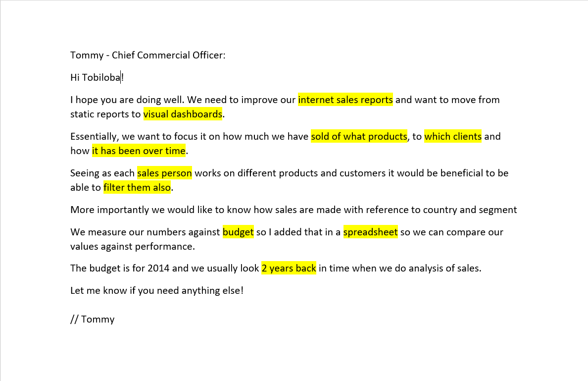
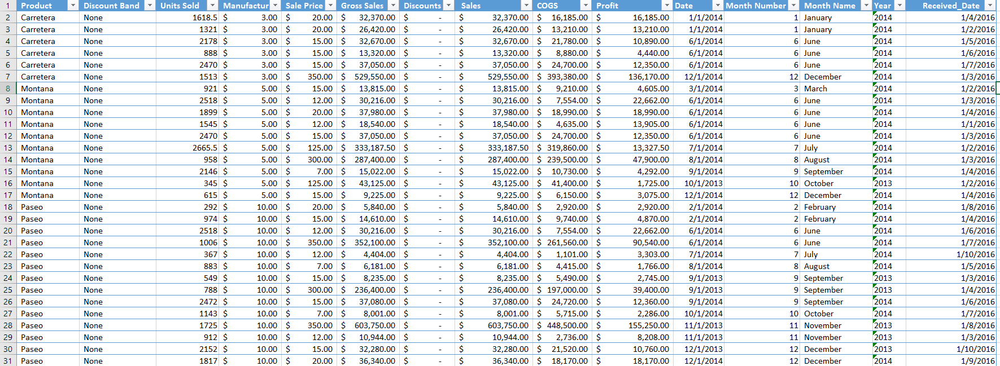
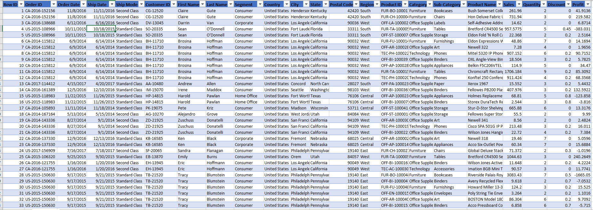
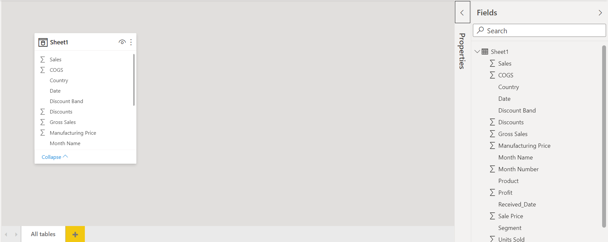
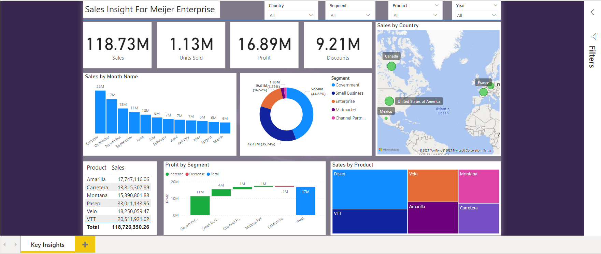

# Sales-Insight-For-Meijer-Enterprise
<h2>Business Request & User Stories</h2> 
This business request for the data analyst to execute sales report for Chief Commercial Officer. 
Based on the request that was made from the business we following user stories were defined to fulfill delivery and ensure that acceptance criteria’s were maintained throughout the project.  

 
<h2>Data Cleansing & Transformation SQL</h2>
 
Two data sources (sales budgets) were provided in Excel format and were connected in the data model in a later step of the process.

 

<h2>Data Model</h2>
 
Below is a screenshot of the data model after cleansed and prepared tables were read into Power BI.
 

 
<h2>Key Insight Dashboard</h2>
 

 
